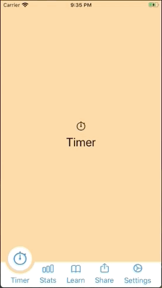

# TabBarExample2

I came across a [YouTube video](https://www.youtube.com/watch?v=SythDf1r4oE) of someone explaining how to create an animated tab bar. The final result is *really nice* but the code is... well, hacky as hacky can be. It lacks structure, it's full of duplicated code, has lots of index-juggling, and calls to `DispatchQueue.main.async()` to avoid changing the view's state while it's being rendered by SwiftUI. In summary, it's the sort of hack that is unacceptable in a professional setting.

So, I decided to give it a go and try to replicate the effect using well-written code that is easy to read and reasonably easy to understand and maintain. The result appears below.

It doesn't replicate the YouTube video's result *exactly* but the differences are minor and easily fixable. Basically, I would have to use a shape other than a `Circle` and animate its motion vertically as well as horizontally.

## License ##

**TabBarExample2** is available under the MIT license. See the LICENSE file for
more info.
